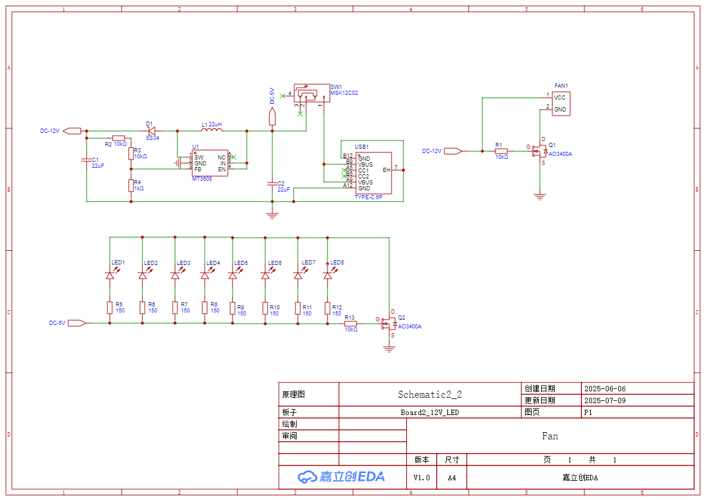
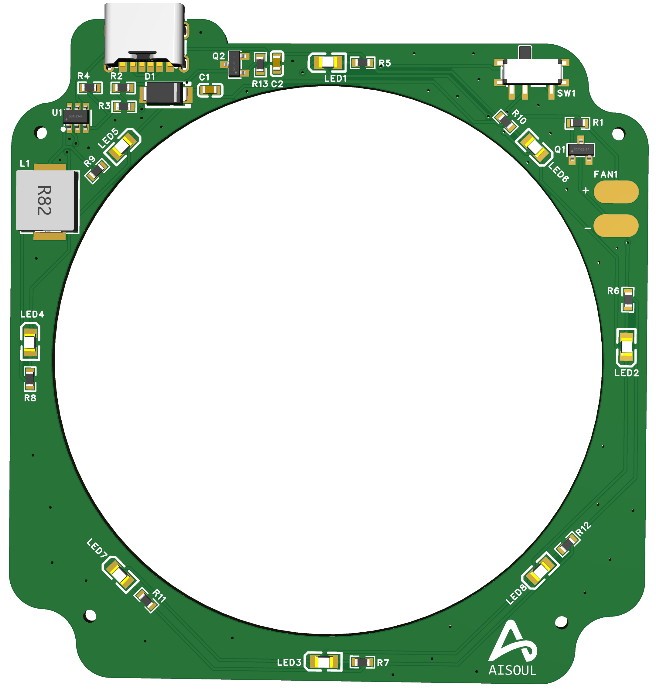

# Type-C 供电风扇控制器 (MT3608)

🎉 这是一个紧凑的USB Type-C供电板，使用MT3608升压转换器输出12V为冷却风扇供电，5V为LED供电。它配备电源开关、MOSFET控制的输出，支持0.77A负载。

## 🎯 项目用途

这个项目主要用于：
- **焊接时吸走焊烟**：利用风扇将焊接元器件时产生的有害焊烟吸走
- **PCB降温**：对焊接好的PCB进行快速降温
- **桌面空气净化**：作为小型桌面空气净化器使用

## 🔋 主要特性

- USB Type-C 5V输入
- 通过MT3608升压至12V
- 拨动开关实现全功率控制
- 风扇和LED MOSFET开关控制
- 12V 6025暴力风扇
- 专为焊接工作台和迷你冷却应用设计

## 📐 原理图与PCB

查看 `/schematic` 和 `/pcb` 文件夹中的文件。

## 📦 BOM 主要元件

| 元件 | 数值 | 说明 |
|------|------|------|
| U1 | MT3608 | 升压转换器 |
| D1 | SS34 | 肖特基二极管 |
| Q1/Q2 | AO3400A | N沟道MOSFET |
| L1 | 22µH ≥2A | 功率电感 |
| R1/R2/R3 | 分压电阻 | 设置Vout ~12.6V |
| SW1 | MSK12C02 | SPDT拨动开关 |

## 📷 演示

## 🛠 制作步骤

1. 在您的EDA工具中打开 `typec_power.sch`（如EasyEDA或KiCAD）
2. 生成Gerber和BOM文件
3. 上传到JLCPCB / LCSC进行制造
4. 焊接/组装并测试

## 🔧 使用方法

1. 将Type-C线连接到电源（5V/2A以上）
2. 拨动开关开启电源
3. 风扇开始运转，吸走焊接产生的焊烟
4. 焊接完成后，可用风扇对PCB进行降温

## 📜 许可证

本项目采用 [MIT许可证](LICENSE) 授权。

## 🤝 贡献

欢迎提交Issue和Pull Request来改进这个项目！

## 📞 联系方式

如有问题或建议，请在GitHub上创建Issue。
