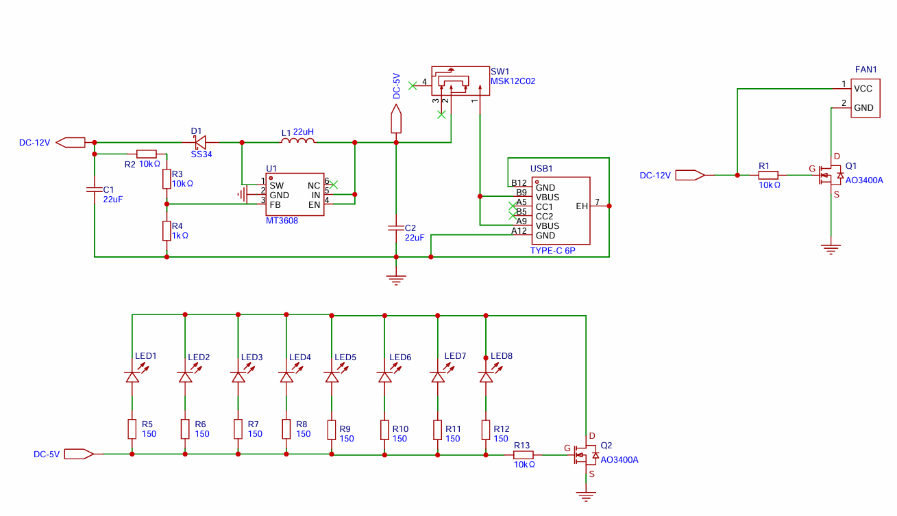
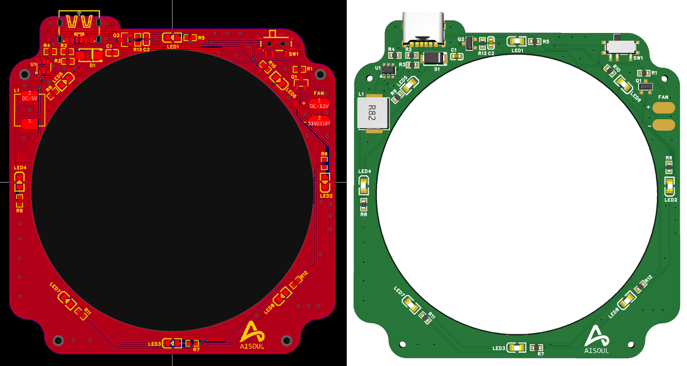
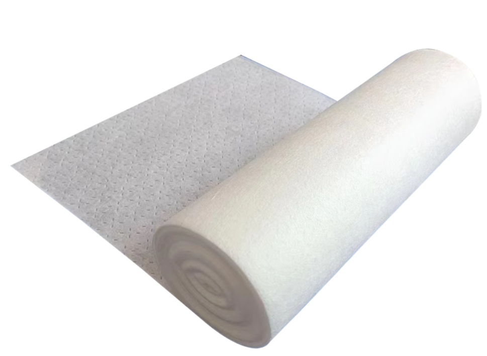
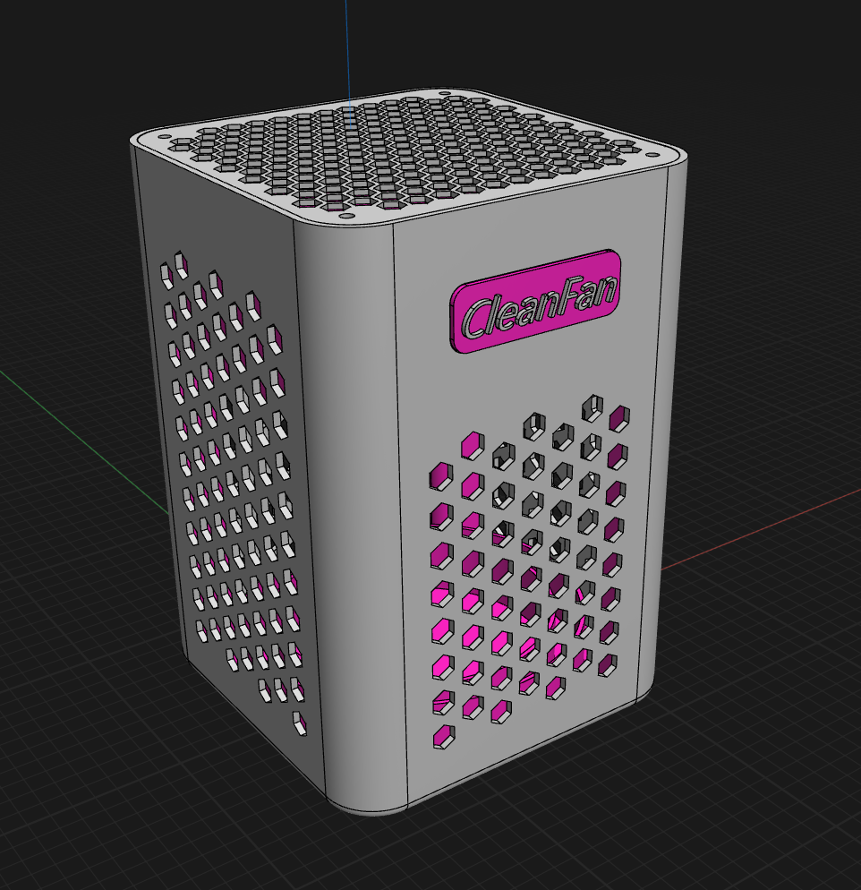

---

## 语言/Languages
- [中文](#type-c-供电桌面净化风扇-cleanfan-mt3608)
- [English](#english-version)

---

## English Version

# Type-C Powered Desktop Air Purifier Fan - CleanFan (MT3608)

🎉 CleanFan is a powerful desktop air purifier fan, with dimensions of approximately 82mm x 82mm x 120mm. 5V input, MT3608 boosts to 12V for the cooling fan and 5V for the LED. It features a power switch and MOSFET-controlled output. The fan uses a 6025 (12V, 0.72A) high-power fan for strong airflow, efficiently removing solder smoke. Dual-layer filtration: inner layer is HEPA filter paper, outer layer is filter cotton (30ppi), reducing harmful substances. The strong airflow also helps cool down freshly soldered PCBs quickly.

## 🎯 Purpose

This project is mainly for:
- **Removing solder smoke**: The fan draws away harmful smoke during soldering
- **Filtering smoke**: Dual-layer structure filters harmful substances
- **PCB cooling**: Quickly cools down soldered PCBs
- **PCB cooling platform**: Anodized aluminum mesh as a platform, fan blows upward for cooling
- **Desktop air purification**: Can be used as a small desktop air purifier

## 🔋 Features

- USB Type-C 5V input
- Boosts to 12V via MT3608
- Toggle switch for full power control
- MOSFET switch control for fan and LED
- 12V 6025 high-power fan
- **Anodized aluminum mesh**: Excellent heat dissipation, serves as PCB platform
- **Upward airflow design**: Fan draws air from outside and blows upward for PCB cooling
- **JLCEDA design**: Schematic and PCB designed with JLCEDA
- Designed for soldering workbench and mini cooling applications

## 📐 Schematic & PCB

This project is designed with JLCEDA. See files in `/schematic` and `/pcb` folders. Auto-routing was used for PCB layout.

- **Schematic**: `schematic/typec_power.pdf` (JLCEDA format)
- **PCB file**: `.epro` file in `pcb/` directory

## 📦 BOM Main Components

### Electronic Components
| No. | Category      | Model      | Package                    | Qty |
|-----|--------------|------------|----------------------------|-----|
| 1   | Capacitor    | 22uF       | C0603                      | 2   |
| 2   | Diode        | SS34       | SMA_L4.2-W2.7-LS5.0-RD     | 1   |
| 3   | Inductor     | 22uH       | FXL0630-220-M              | 1   |
| 4   | LED          | NCD0805R1  | LED0805-R-RD               | 8   |
| 5   | MOSFET       | AO3400A    | SOT-23-3_L2.9-W1.3-P1.90...| 2   |
| 6   | Resistor     | 10kΩ       | R0603                      | 4   |
| 7   | Resistor     | 1kΩ        | R0603                      | 1   |
| 8   | Resistor     | 150Ω       | R0603                      | 8   |
| 9   | Switch       | MSK12C02   | SW-TH_MSK12C02             | 1   |
| 10  | Booster IC   | MT3608     | SOT-23-6_L2.9-W1.6-P0.95...| 1   |
| 11  | Power Port   | TYPE-C 6P  | TYPE-C-SMD_TYPE-C-6P       | 1   |

### Mechanical Components
| No. | Part        | Spec                | Note                        |
|-----|-------------|---------------------|-----------------------------|
| 1   | Fan         | 12V 0.72A 6025      | High airflow fan            |
| 2   | Alu. mesh   | Anodized            | Sheet metal + anodized, for PCB platform, excellent heat dissipation |
| 3   | Case        | 3D printed          | Support structure, aesthetic|
| 4   | Nut         | m2x3x3              | 8 pcs                       |
| 5   | Nut         | m1.4x1.5x2.3        | 4 pcs                       |
| 6   | Screw       | m2x10               | 4 pcs                       |
| 7   | Screw       | m2x50               | 4 pcs                       |
| 8   | Screw       | m1.4x4x2.3          | 4 pcs                       |
| 9   | Anti-vibration pad | 10mm x 1mm   | 3M single-sided foam tape, 4 pcs |

## 🌿 Fan & Filtration

To efficiently remove smoke, a 12V 0.72A 6025 fan is used (2-wire is sufficient). The fan provides strong airflow for effective smoke removal. For filtration, a two-layer system is used: outer layer is 30ppi dust filter cotton for good airflow, inner layer is HEPA filter paper.

## 🖨️ 3D Printed Case

Directly use Twotrees slicing software, 0.4mm nozzle, standard 0.2mm layer height. The main case uses gray metallic PLA, internal parts use deep pink PLA, overall color scheme inspired by Dyson products. With blue LED, the effect is quite nice.

## 🔧 Usage

### During Soldering
1. Connect the Type-C cable to a power supply (5V/2A or above)
2. Toggle the switch to turn on the power
3. The fan starts running and removes solder smoke

### For PCB Cooling
1. Place the soldered PCB on the anodized aluminum mesh
2. The fan draws in outside air and blows upward
3. Cool air passes through the mesh, quickly cooling the PCB
4. The high thermal conductivity of the mesh accelerates cooling

### Dual Function
- **During soldering**: Removes smoke, protects health
- **After soldering**: Quickly cools PCB, improves efficiency

## 📜 License

This project is licensed under [Creative Commons Attribution-NonCommercial-ShareAlike 4.0](LICENSE).

**Terms of Use:**
- ✅ **Allowed**: Personal study, DIY, non-commercial use
- ❌ **Prohibited**: Commercial use, sales
- 📋 **Requirement**: Must credit the original author, modified versions must use the same license

## 🤝 Contributing

Issues and Pull Requests are welcome to improve this project!

## 📞 Contact

For questions or suggestions, please contact: zhangci226@163.com
