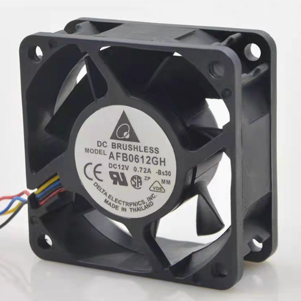
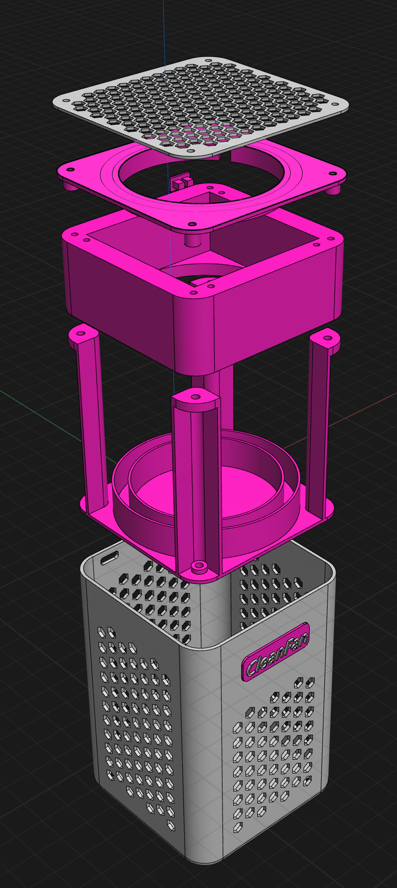

# Type-C 供电桌面净化风扇-CleanFan (MT3608)

🎉 CleanFan是一个暴力桌面净化风扇，尺寸约 82mm x 82mm x 120mm。5V输入，使用MT3608升压输出12V为冷却风扇供电，5V为LED供电。它配备电源开关、MOSFET控制的输出。该桌面净化风扇使用规格为6025，0.72A的暴力风扇，全功率运行，能有效吸走焊锡、焊台、焊膏产生的焊烟。同时，使用双层过滤材料，内层为hepa过滤纸，外层为过滤棉，尽可能减少焊烟中的有害物质。同时，其产生的大风量也能为刚焊接好的PCB板快速降温。

## 🎯 用途

这个项目主要用于：
- **焊接时吸走焊烟**：利用风扇将焊接元器件时产生的有害焊烟吸走
- **过滤焊烟**：双层过滤结构过滤有害物质
- **PCB降温**：对焊接好的PCB进行快速降温
- **PCB冷却平台**：阳极氧化铝合金网作为PCB放置平台，风扇向上吹风冷却
- **桌面空气净化**：作为小型桌面空气净化器使用

## 🔋 主要特性

- USB Type-C 5V输入
- 通过MT3608升压至12V
- 拨动开关实现全功率控制
- 风扇和LED MOSFET开关控制
- 12V 6025暴力风扇
- **阳极氧化铝合金网**：作为PCB放置平台，散热性能优异
- **向上吹风设计**：风扇吸入外部空气向上排出，形成PCB冷却气流
- **嘉立创EDA设计**：使用嘉立创EDA进行原理图和PCB设计
- 专为焊接工作台和迷你冷却应用设计

## 📐 原理图与PCB

本项目使用嘉立创EDA进行设计。查看 `/schematic` 和 `/pcb` 文件夹中的文件。我在PCB布线的时候，懒得自己布线了，直接使用自动布线功能。

- **原理图文件**：`schematic/typec_power.pdf` - 嘉立创EDA格式
- **PCB文件**：`pcb/` 目录下的epro文件

## 📦 BOM 主要元件

### 电子元件
| 序号 | 类别   | 型号         | 封装                        | 数量 |
|------|--------|--------------|-----------------------------|------|
| 1    | 电容   | 22uF         | C0603                       | 2    |
| 2    | 二极管 | SS34         | SMA_L4.2-W2.7-LS5.0-RD      | 1    |
| 3    | 电感   | 22uH         | FXL0630-220-M               | 1    |
| 4    | LED    | NCD0805R1    | LED0805-R-RD                | 8    |
| 5    | MOS管  | AO3400A      | SOT-23-3_L2.9-W1.3-P1.90... | 2    |
| 6    | 电阻   | 10kΩ         | R0603                       | 4    |
| 7    | 电阻   | 1kΩ          | R0603                       | 1    |
| 8    | 电阻   | 150Ω         | R0603                       | 8    |
| 9    | 开关   | MSK12C02     | SW-TH_MSK12C02              | 1    |
| 10   | 升压芯片     | MT3608       | SOT-23-6_L2.9-W1.6-P0.95... | 1    |
| 11   | 供电口 | TYPE-C 6P    | TYPE-C-SMD_TYPE-C-6P        | 1    |

### 机械元件
| 序号 | 元件     | 规格           | 说明                 |
|------|----------|----------------|----------------------|
| 1    | 风扇     | 12V 0.72A 6025       | 暴力风扇，高风量     |
| 2    | 铝合金网 | 阳极氧化处理   | PCB放置平台，钣金+阳极氧化，散热优异 |
| 3    | 外壳     | 3D打印         | 支撑结构，美观实用   |
| 4    | 螺母     | m2x3x3         | 8颗                  |
| 5    | 螺母     | m1.4x1.5x2.3   | 4颗                  |
| 6    | 螺丝     | m2x10          | 4颗                  |
| 7    | 螺丝     | m2x50          | 4颗                  |
| 8    | 螺丝     | m1.4x4x2.3   | 4颗                  |
| 9    | 防震垫   | 10mm x 1mm   | 3m单面泡棉胶带圆点胶贴 4颗 |

## 🌿 风扇和过滤
为了让风扇能够将烟吸走，我采用了额定功率为12V，0.72A的规格为6025的风扇，使用2线的即可。这个风扇的风力比较大，能够较好的吸走焊烟。过滤的话，我使用了2层过滤，外面一层为防尘过滤棉，为了能让空气比较好的流通，采用的密度为30ppi，里面一层使用了hepa过滤纸。

## 🖨️ 3D打印外壳

查看 `/3d_models` 文件夹中的3D模型文件。

### 文件格式说明
- **3mf文件** (`/3d_models/`) - 直接用于3D打印

### 3D打印外壳
直接使用拓竹切片软件，0.4喷嘴和标准的0.2mm层高。外壳主体采用灰色金属pla材料，内部构件采用深粉色pla材料，整体上采用了戴森产品的配色。配合蓝色的led灯，整体效果还不错。

## 🔧 使用方法

### 焊接时使用
1. 将Type-C线连接到电源（5V/2A以上）
2. 拨动开关开启电源
3. 风扇开始运转，吸走焊接产生的焊烟

### PCB冷却使用
1. 将焊接完成的PCB放置在阳极氧化铝合金网上
2. 风扇吸入外部空气，向上吹风
3. 冷空气通过铝合金网，快速冷却PCB
4. 铝合金网的高导热性加速散热过程

### 双重功能
- **焊接时**：吸走焊烟，保护健康
- **焊接后**：快速冷却PCB，提高工作效率

## 📜 许可证

本项目采用 [Creative Commons Attribution-NonCommercial-ShareAlike 4.0](LICENSE) 许可证授权。

**使用条款：**
- ✅ **允许**：个人学习、DIY制作、非商业用途
- ❌ **禁止**：商业用途、商业销售
- 📋 **要求**：必须标注原作者，修改版本必须使用相同许可证

## 🤝 贡献

欢迎提交Issue和Pull Request来改进这个项目！

## 📞 联系方式

如有问题或建议，请联系 zhangci226@163.com
