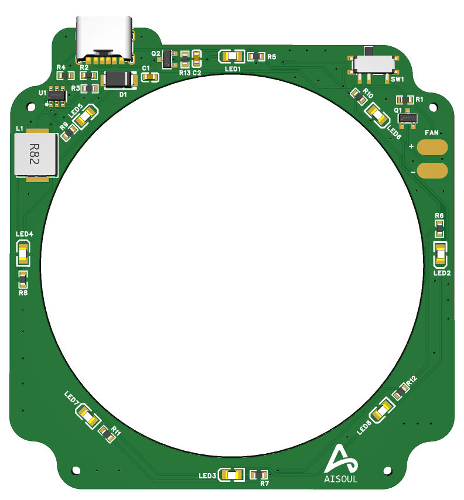

# Type-C 供电桌面净化风扇-CleanFan (MT3608)

🎉 CleanFan是一个暴力桌面净化风扇。5V输入，使用MT3608升压输出12V为冷却风扇供电，5V为LED供电。它配备电源开关、MOSFET控制的输出。该桌面净化风扇使用规格为6025，0.72A的暴力风扇，全功率运行，能有效吸走焊锡、焊台、焊膏产生的焊烟。同时，使用双层过滤材料，内层为hepa过滤纸，外层为过滤棉，尽可能减少焊烟中的有害物质。同时，其产生的大风量也能为刚焊接好的PCB板快速降温。

## 🎯 项目用途

这个项目主要用于：
- **焊接时吸走焊烟**：利用风扇将焊接元器件时产生的有害焊烟吸走
- **过滤焊烟**：双层过滤结构过滤有害物质
- **PCB降温**：对焊接好的PCB进行快速降温
- **PCB冷却平台**：阳极氧化铝合金网作为PCB放置平台，风扇向上吹风冷却
- **桌面空气净化**：作为小型桌面空气净化器使用

## 🔋 主要特性

- USB Type-C 5V输入
- 通过MT3608升压至12V
- 拨动开关实现全功率控制
- 风扇和LED MOSFET开关控制
- 12V 6025暴力风扇
- **阳极氧化铝合金网**：作为PCB放置平台，散热性能优异
- **向上吹风设计**：风扇吸入外部空气向上排出，形成PCB冷却气流
- **嘉立创EDA设计**：使用嘉立创EDA进行原理图和PCB设计
- 专为焊接工作台和迷你冷却应用设计

## 📐 原理图与PCB

本项目使用嘉立创EDA进行设计。查看 `/schematic` 和 `/pcb` 文件夹中的文件。我在PCB布线的时候，懒得自己布线了，直接使用自动布线功能。

- **原理图文件**：`schematic/typec_power.pdf` - 嘉立创EDA格式
- **PCB文件**：`pcb/` 目录下的epro文件

## 🖨️ 3D打印外壳

查看 `/3d_models` 文件夹中的3D模型文件。

### 文件格式说明
- **STL文件** (`/3d_models/stl/`) - 直接用于3D打印
- **STEP文件** (`/3d_models/step/`) - 可编辑的CAD格式

### 推荐打印参数
- **材料**：PLA/PETG
- **层高**：0.2mm
- **填充**：20-30%
- **支撑**：需要（根据模型而定）
- **打印方向**：建议垂直放置

## 📦 BOM 主要元件

### 电子元件
| 元件 | 数值 | 说明 |
|------|------|------|
| U1 | MT3608 | 升压转换器 |
| D1 | SS34 | 肖特基二极管 |
| Q1/Q2 | AO3400A | N沟道MOSFET |
| L1 | 22µH ≥2A | 功率电感 |
| R1/R2/R3 | 分压电阻 | 设置Vout ~12.6V |
| SW1 | MSK12C02 | SPDT拨动开关 |

### 机械元件
| 元件 | 规格 | 说明 |
|------|------|------|
| 风扇 | 12V 6025 | 暴力风扇，高风量 |
| 铝合金网 | 阳极氧化处理 | PCB放置平台，散热优异 |
| 外壳 | 3D打印 | 支撑结构，美观实用 |

## 📷 演示

## 🛠 制作步骤

### 电路板制作
1. 在嘉立创EDA中打开 `typec_power.sch` 项目文件
2. 生成Gerber和BOM文件
3. 上传到嘉立创PCB进行制造
4. 焊接/组装并测试

### 3D打印外壳
1. 下载 `/3d_models/stl/` 目录中的STL文件
2. 使用切片软件（如Cura、PrusaSlicer）导入模型
3. 按照推荐的打印参数设置
4. 打印完成后进行后处理（去支撑、打磨等）
5. 将PCB和风扇安装到外壳中

## 🔧 使用方法

### 焊接时使用
1. 将Type-C线连接到电源（5V/2A以上）
2. 拨动开关开启电源
3. 风扇开始运转，吸走焊接产生的焊烟

### PCB冷却使用
1. 将焊接完成的PCB放置在阳极氧化铝合金网上
2. 风扇吸入外部空气，向上吹风
3. 冷空气通过铝合金网，快速冷却PCB
4. 铝合金网的高导热性加速散热过程

### 双重功能
- **焊接时**：吸走焊烟，保护健康
- **焊接后**：快速冷却PCB，提高工作效率

## 📜 许可证

本项目采用 [Creative Commons Attribution-NonCommercial-ShareAlike 4.0](LICENSE) 许可证授权。

**使用条款：**
- ✅ **允许**：个人学习、DIY制作、非商业用途
- ❌ **禁止**：商业用途、商业销售
- 📋 **要求**：必须标注原作者，修改版本必须使用相同许可证

## 🤝 贡献

欢迎提交Issue和Pull Request来改进这个项目！

## 📞 联系方式

如有问题或建议，请在GitHub上创建Issue。
